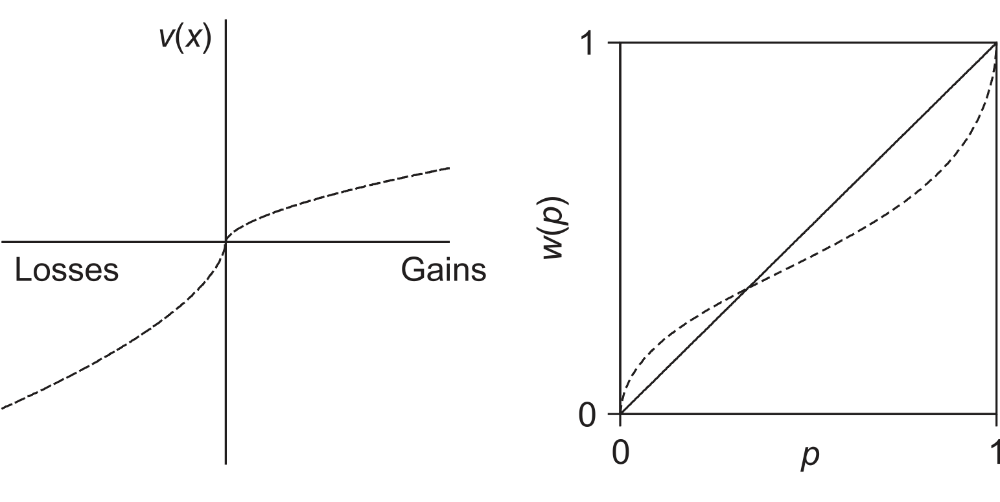
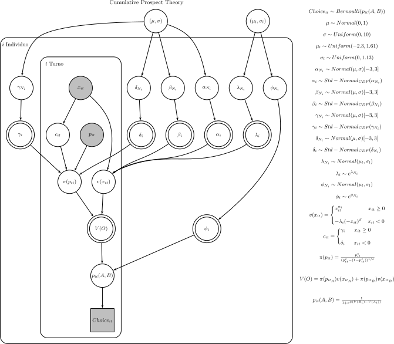

(see below English translation)

Esta entrada tiene al final el código en PyMC3 para la estimación Bayesiana de los parámetros de teoría de prospectos (adaptado de la version winbugs de [Nilsson, et al, 2011](https://www.researchgate.net/publication/222825338_Hierarchical_Bayesian_parameter_estimation_for_cumulative_prospect_theory)). 

Una de las teorías más conocidas en economía del comportamiento es prospect theory. Es una teoría tradicional de valor esperado (V) donde el agente combina valor y probabilidad (V = vp) para decidir. El valor (v) y la probabilidad (p) que se observa en la realidad se transforma/percibe de forma no-lineal y se juzgan a partir de una referencia. La imagen de abajo muestra las dos funciones propuestas en teoría de prospectos (líneas punteadas).

<center></center>


Las formulas de estas gráficas son:

Valor:

$$
 
f(a,b) = 
     \begin{cases}
       \text{open,} &\quad\text{if RMSD}_\text{s-open}\ge6, \text{RMSD}_\text{closed}\ge6\\
       \text{closed,} &\quad\text{if RMSD}_\text{closed}\le2 \\
       \text{semiopen,} &\quad\text{if RMSD}_\text{s-open}\le2\\
       \text{transition,} &\quad\text{otherwise.} \\ 
     \end{cases}
$$

$$
\alpha \; \& \; \beta \; \text{miden actitudes de riesgo}
$$


Probabilidades:
$$
w(p_x) = \frac{p_x^c}{(p_x^c - (1-p_x^c))^{1/c}}
$$

$$
c = \gamma \text{ si ganancia, } c = \delta \text{ si perdida. Determinan la forma de w(p)}
$$


El agente decide en función del valor esperado V.
$$
V(x) = v(x)w(p_x)
$$
Por ejemplo, Nilsson, et al (2011) proponen una decisión estocástica entre el valor esperado de dos opciones A y B.
$$
p(A) = \frac{1}{1+e^{\phi(V(B)-V(A))}}
$$

$$
\phi \; \text{determina lo importante que es la diferencia de valor para escoger A (o B)}
$$

En suma, son 6 parámetros a estimar
$$
\alpha ,\; \beta \;\text{actitudes al riesgo}, \lambda \; \text{aversion perdidas}, \gamma \;, \delta \; \text{percepción de probabilidad}, \phi
$$


La versión de prospect theory propuesta por Nilsson, et al (2011) es jerárquica (ver diagrama abajo) e invitó al lector a leer su paper para mayores detalles. En general, al hacer una versión jerárquica se aprovecha la información de todos los sujetos para obtener mayor precisión en la estimación de los parámetros por sujeto.

<center></center>


# Python Code

El material de Nilsson et al (2011), los datos necesarios, y mi implementación en PyMC3 también se pueden encontrar en este [link](https://github.com/santiagoalonso/Cognitive-models/tree/master/Prospect%20Theory)

```python
#Libraries and functions
import pymc3 as pm
import theano.tensor as tt #NOTA: theano va a cambiar a tensorflow en PyMC4
import numpy as np
import pandas as pd

def norm_cdf(x, mean=0, std=1):
    return (1.0 + tt.erf((x-mean) / tt.sqrt(2.0*(std**2)))) / 2.0 #cdf; (x is a normal sample)

# Load data
gambles_A = pd.read_table("GambleA.txt", header=None)
gambles_A.columns = ['Reward_1', 'Prob_1', 'Reward_2', 'Prob_2']
gambles_A_win = gambles_A.loc[0:59,:].copy()
gambles_A_loss = gambles_A.loc[60:119,:].copy()
gambles_A_mix = gambles_A.loc[120:179,:].copy()
gambles_B = pd.read_table("GambleB.txt", header=None)
gambles_B.columns = ['Reward_1', 'Prob_1', 'Reward_2', 'Prob_2']
gambles_B_win = gambles_B.loc[0:59,:].copy()
gambles_B_loss = gambles_B.loc[60:119,:].copy()
gambles_B_mix = gambles_B.loc[120:179,:].copy()
Rieskamp_data = pd.read_table('Rieskamp_data.txt', header=None) 
# 0: choice gamble A
# 1: choice gamble B
Rieskamp_data_win = Rieskamp_data.loc[0:59,:].copy()
Rieskamp_data_loss = Rieskamp_data.loc[60:119,:].copy()
Rieskamp_data_mix = Rieskamp_data.loc[120:179,:].copy()
ntrials = Rieskamp_data.shape[0]
ntrials_by_type = int(ntrials/3)
nsubj = Rieskamp_data.shape[1]


#PyMC3 model
with pm.Model() as CPT:  
    # Here priors for the hyperdistributions are defined:
    ### alpha (risk attitude win)
    mu_alpha_N = pm.Normal('mu_alpha_N', 0, 1)
    sigma_alpha_N = pm.Uniform('sigma_alpha_N', 0, 10)
    ### beta (risk attitude lose)
    mu_beta_N = pm.Normal('mu_beta_N', 0, 1)
    sigma_beta_N = pm.Uniform('sigma_beta_N', 0, 10)
    ### gamma (non-linearity in prob. win)
    mu_gamma_N = pm.Normal('mu_gamma_N', 0, 1)
    sigma_gamma_N = pm.Uniform('sigma_gamma_N', 0, 10)
    ### delta (non-linearity in prob. lose)
    mu_delta_N = pm.Normal('mu_delta_N', 0, 1)
    sigma_delta_N = pm.Uniform('sigma_delta_N', 0, 10)
    ### lambda (loss aversion)
    mu_l_lambda_N = pm.Uniform('mu_l_lambda_N', -2.3, 1.61)
    sigma_l_lambda_N = pm.Uniform('sigma_l_lambda_N', 0, 1.13)
    ### luce (temperature of softmax)
    mu_l_luce_N = pm.Uniform('mu_l_luce_N', -2.3, 1.61)
    sigma_l_luce_N = pm.Uniform('sigma_l_luce_N', 0, 1.13)
    
    ## We put group-level normal's on the individual parameters.
    ## This models alpha, beta, gamma, and delta as probitized parameters. 
    ## That is, it models parameteres on the probit scale and then 
    ## puts them back to the range 0-1 with the CDF.
    ## Lambda and luce are positive and modeled in log scale.
    ## Each participant has unique parameter-values: 
    ## alpha, beta, gamma, delta, lambda, and luce
    alpha_N = pm.TruncatedNormal('alpha_N', mu_alpha_N, sigma_alpha_N,
                                 lower = -3, upper = 3,
                                 shape = nsubj)
    beta_N = pm.TruncatedNormal('beta_N', mu_beta_N, sigma_beta_N,
                                lower = -3, upper = 3,
                                shape = nsubj)
    gamma_N = pm.TruncatedNormal('gamma_N', mu_gamma_N, sigma_gamma_N,
                                 lower = -3, upper = 3,
                                 shape = nsubj)
    delta_N = pm.TruncatedNormal('delta_N', mu_delta_N, sigma_delta_N,
                                 lower = -3, upper = 3,
                                 shape = nsubj)
    lambda_N = pm.Normal('lambda_N', mu_l_lambda_N, sigma_l_lambda_N,
                        shape = nsubj)
    luce_N = pm.Normal('luce_N', mu_l_luce_N, sigma_l_luce_N,
                       shape = nsubj)
    
    ### Put everything in the desired scale
    ## We use cdf to bound probitized parameters to be in 0-1
    alpha = pm.Deterministic('alpha', norm_cdf(alpha_N))
    beta = pm.Deterministic('beta', norm_cdf(beta_N))
    gamma = pm.Deterministic('gamma', norm_cdf(gamma_N))
    delta = pm.Deterministic('delta', norm_cdf(delta_N))
    ## We exp because we assume a log. scale
    lambd = pm.Deterministic('lambbda', tt.exp(lambda_N))
    luce = pm.Deterministic('luce', tt.exp(luce_N))
    
    
    
    
    
    # It is now time to define how the model should be fit to data.
    ############ WIN TRIALS ############
    gambless_A = gambles_A_win
    gambless_B = gambles_B_win
    ##GAMBLE A
    ## subjective value of outcomes x & y in gamble A
    reward_1 = np.tile(np.array(gambless_A['Reward_1']),(nsubj,1)).transpose()
    reward_2 = np.tile(np.array(gambless_A['Reward_2']),(nsubj,1)).transpose()
    v_x_a = pm.Deterministic('v_x_a', reward_1**tt.tile(alpha,(ntrials_by_type,1)))
    v_y_a = pm.Deterministic('v_y_a', reward_2**tt.tile(alpha,(ntrials_by_type,1)))
    
    ## subjective prob. of outcomes x & y in gamble A
    prob_1 = np.tile(np.array(gambless_A['Prob_1']),(nsubj,1)).transpose()
    prob_2 = np.tile(np.array(gambless_A['Prob_2']),(nsubj,1)).transpose()
    z_a = pm.Deterministic('z_a', prob_1**tt.tile(gamma,(ntrials_by_type,1)) + prob_2**tt.tile(gamma,(ntrials_by_type,1)))
    den_a = pm.Deterministic('den_a', z_a**(1/tt.tile(gamma,(ntrials_by_type,1))))
    num_x_a = pm.Deterministic('num_x_a', prob_1**tt.tile(gamma,(ntrials_by_type,1)))
    w_x_a =  pm.Deterministic('w_x_a', num_x_a / den_a)  
    num_y_a = pm.Deterministic('num_y_a', prob_2**tt.tile(gamma,(ntrials_by_type,1)))
    w_y_a =  pm.Deterministic('w_y_a', num_y_a / den_a) 
       
    ##subjective value of gamble A
    Vf_a = pm.Deterministic('Vf_a', w_x_a * v_x_a + w_y_a * v_y_a)
   

    #GAMBLE B
    ## subjective value of outcomes x & y in gamble B
    reward_1 = np.tile(np.array(gambless_B['Reward_1']),(nsubj,1)).transpose()
    reward_2 = np.tile(np.array(gambless_B['Reward_2']),(nsubj,1)).transpose()
    v_x_b = pm.Deterministic('v_x_b', reward_1**tt.tile(alpha,(ntrials_by_type,1)))
    v_y_b = pm.Deterministic('v_y_b', reward_2**tt.tile(alpha,(ntrials_by_type,1)))
    
    ## subjective prob. of outcomes x & y in gamble B
    prob_1 = np.tile(np.array(gambless_B['Prob_1']),(nsubj,1)).transpose()
    prob_2 = np.tile(np.array(gambless_B['Prob_2']),(nsubj,1)).transpose()
    z_b = pm.Deterministic('z_b', prob_1**tt.tile(gamma,(ntrials_by_type,1)) + prob_2**tt.tile(gamma,(ntrials_by_type,1)))
    den_b = pm.Deterministic('den_b', z_b**(1/tt.tile(gamma,(ntrials_by_type,1))))
    num_x_b = pm.Deterministic('num_x_b', prob_1**tt.tile(gamma,(ntrials_by_type,1)))
    w_x_b =  pm.Deterministic('w_x_b', num_x_b / den_b)  
    num_y_b = pm.Deterministic('num_y_b', prob_2**tt.tile(gamma,(ntrials_by_type,1)))
    w_y_b =  pm.Deterministic('w_y_b', num_y_b / den_b)   
    
    ##subjective value of gamble B
    Vf_b = pm.Deterministic('Vf_b', w_x_b * v_x_b + w_y_b * v_y_b)
    
    ## Difference in value
    #print(den)
    dv = pm.Deterministic('D', (Vf_a - Vf_b))
    ##likelihood 
    ## choice for gamble-pair is a Bernoulli-distribution 
    ## with p = binval 
    ## binval is luce's choice rule (akin to a softmax) 
    binval = pm.Deterministic('binval', 1/(1+tt.exp((tt.tile(luce,(ntrials_by_type,1))) * (dv)))) #prob. of B
    datta = np.array(Rieskamp_data_win)
    win_obs = pm.Bernoulli('win_obs', p = binval, observed = datta)
    
    
    
    
    
    ############ LOSS TRIALS ############
    gambless_A = gambles_A_loss
    gambless_B = gambles_B_loss
    ##GAMBLE A
    ## subjective value of outcomes x & y in gamble A
    reward_1 = np.tile(np.array(gambless_A['Reward_1']),(nsubj,1)).transpose()
    reward_2 = np.tile(np.array(gambless_A['Reward_2']),(nsubj,1)).transpose()
    v_x_a_l = pm.Deterministic('v_x_a_l', (-1)*((-reward_1)**tt.tile(beta,(ntrials_by_type,1))))
    v_y_a_l = pm.Deterministic('v_y_a_l', (-1)*((-reward_2)**tt.tile(beta,(ntrials_by_type,1))))

    ## subjective prob. of outcomes x & y in gamble A
    prob_1 = np.tile(np.array(gambless_A['Prob_1']),(nsubj,1)).transpose()
    prob_2 = np.tile(np.array(gambless_A['Prob_2']),(nsubj,1)).transpose()
    z_a_l = pm.Deterministic('z_a_l', prob_1**tt.tile(delta,(ntrials_by_type,1)) + prob_2**tt.tile(delta,(ntrials_by_type,1)))
    den_a_l = pm.Deterministic('den_a_l', z_a_l**(1/tt.tile(delta,(ntrials_by_type,1))))
    num_x_a_l = pm.Deterministic('num_x_a_l', prob_1**tt.tile(delta,(ntrials_by_type,1)))
    w_x_a_l =  pm.Deterministic('w_x_a_l', num_x_a_l / den_a_l)  
    num_y_a_l = pm.Deterministic('num_y_a_l', prob_2**tt.tile(delta,(ntrials_by_type,1)))
    w_y_a_l =  pm.Deterministic('w_y_a_l', num_y_a_l / den_a_l) 
    
    ##subjective value of gamble A
    Vf_a_l = pm.Deterministic('Vf_a_l', w_x_a_l * v_x_a_l + w_y_a_l * v_y_a_l)
    
    
    #GAMBLE B
    ## subjective value of outcomes x & y in gamble B
    reward_1 = np.tile(np.array(gambless_B['Reward_1']),(nsubj,1)).transpose()
    reward_2 = np.tile(np.array(gambless_B['Reward_2']),(nsubj,1)).transpose()
    v_x_b_l = pm.Deterministic('v_x_b_l', (-1)*((-reward_1)**tt.tile(beta,(ntrials_by_type,1))))
    v_y_b_l = pm.Deterministic('v_y_b_l', (-1)*((-reward_2)**tt.tile(beta,(ntrials_by_type,1))))
    
    ## subjective prob. of outcomes x & y in gamble B
    prob_1 = np.tile(np.array(gambless_B['Prob_1']),(nsubj,1)).transpose()
    prob_2 = np.tile(np.array(gambless_B['Prob_2']),(nsubj,1)).transpose()
    z_b_l = pm.Deterministic('z_b_l', prob_1**tt.tile(delta,(ntrials_by_type,1)) + prob_2**tt.tile(delta,(ntrials_by_type,1)))
    den_b_l = pm.Deterministic('den_b_l', z_b_l**(1/tt.tile(delta, (ntrials_by_type,1))))
    num_x_b_l = pm.Deterministic('num_x_b_l', prob_1**tt.tile(delta, (ntrials_by_type,1)))
    w_x_b_l =  pm.Deterministic('w_x_b_l', num_x_b_l / den_b_l)  
    num_y_b_l = pm.Deterministic('num_y_b_l', prob_2**tt.tile(delta, (ntrials_by_type,1)))
    w_y_b_l =  pm.Deterministic('w_y_b_l', num_y_b_l / den_b_l)   

    ##subjective value of gamble B
    Vf_b_l = pm.Deterministic('Vf_b_l', w_x_b_l * v_x_b_l + w_y_b_l * v_y_b_l)
    
    ## Difference in value
    #print(den)
    dv_l = pm.Deterministic('D_l', (Vf_a_l - Vf_b_l))
    ##likelihood 
    ## choice for gamble-pair is a Bernoulli-distribution 
    ## with p = binval 
    ## binval is luce's choice rule (akin to a softmax) 
    binval_l = pm.Deterministic('binval_l', 1/(1+tt.exp((tt.tile(luce,(ntrials_by_type,1))) * (dv_l)))) #prob. of B
    datta = np.array(Rieskamp_data_loss)
    loss_obs = pm.Bernoulli('loss_obs', p = binval_l, observed = datta)
    
    
    
    
    
    
    ############ MIX TRIALS ############
    gambless_A = gambles_A_mix
    gambless_B = gambles_B_mix
    ##GAMBLE A
    ## subjective value of outcomes x & y in gamble A
    reward_1 = np.tile(np.array(gambless_A['Reward_1']),(nsubj,1)).transpose()
    reward_2 = np.tile(np.array(gambless_A['Reward_2']),(nsubj,1)).transpose()
    v_x_a_m = pm.Deterministic('v_x_a_m', reward_1**tt.tile(alpha,(ntrials_by_type,1)))
    v_y_a_m = pm.Deterministic('v_y_a_m', (-1*tt.tile(lambd,(ntrials_by_type,1)))*((-reward_2)**tt.tile(beta,(ntrials_by_type,1))))

    ## subjective prob. of outcomes x & y in gamble A
    prob_1 = np.tile(np.array(gambless_A['Prob_1']),(nsubj,1)).transpose()
    prob_2 = np.tile(np.array(gambless_A['Prob_2']),(nsubj,1)).transpose()
    z_a_m = pm.Deterministic('z_a_m', prob_1**tt.tile(gamma,(ntrials_by_type,1)) + prob_2**tt.tile(delta,(ntrials_by_type,1)))
    den_a1_m = pm.Deterministic('den_a1_m', z_a_m**(1/tt.tile(gamma,(ntrials_by_type,1))))
    den_a2_m = pm.Deterministic('den_a2_m', z_a_m**(1/tt.tile(delta,(ntrials_by_type,1))))
    num_x_a_m = pm.Deterministic('num_x_a_m', prob_1**tt.tile(gamma,(ntrials_by_type,1)))
    w_x_a_m =  pm.Deterministic('w_x_a_m', num_x_a_m / den_a1_m)  
    num_y_a_m = pm.Deterministic('num_y_a_m', prob_2**tt.tile(delta,(ntrials_by_type,1)))
    w_y_a_m =  pm.Deterministic('w_y_a_m', num_y_a_m / den_a2_m) 
    
    ##subjective value of gamble A
    Vf_a_m = pm.Deterministic('Vf_a_m', w_x_a_m * v_x_a_m + w_y_a_m * v_y_a_m)
    
    
    ##GAMBLE B
    ## subjective value of outcomes x & y in gamble B
    reward_1 = np.tile(np.array(gambless_B['Reward_1']),(nsubj,1)).transpose()
    reward_2 = np.tile(np.array(gambless_B['Reward_2']),(nsubj,1)).transpose()
    v_x_b_m = pm.Deterministic('v_x_b_m', reward_1**tt.tile(alpha,(ntrials_by_type,1)))
    v_y_b_m = pm.Deterministic('v_y_b_m', (-1*tt.tile(lambd,(ntrials_by_type,1)))*((-reward_2)**tt.tile(beta,(ntrials_by_type,1))))

    ## subjective prob. of outcomes x & y in gamble B
    prob_1 = np.tile(np.array(gambless_B['Prob_1']),(nsubj,1)).transpose()
    prob_2 = np.tile(np.array(gambless_B['Prob_2']),(nsubj,1)).transpose()
    z_b_m = pm.Deterministic('z_b_m', prob_1**tt.tile(gamma,(ntrials_by_type,1)) + prob_2**tt.tile(delta,(ntrials_by_type,1)))
    den_b1_m = pm.Deterministic('den_b1_m', z_b_m**(1/tt.tile(gamma,(ntrials_by_type,1))))
    den_b2_m = pm.Deterministic('den_b2_m', z_b_m**(1/tt.tile(delta,(ntrials_by_type,1))))
    num_x_b_m = pm.Deterministic('num_x_b_m', prob_1**tt.tile(gamma,(ntrials_by_type,1)))
    w_x_b_m =  pm.Deterministic('w_x_b_m', num_x_b_m / den_b1_m)  
    num_y_b_m = pm.Deterministic('num_y_b_m', prob_2**tt.tile(delta,(ntrials_by_type,1)))
    w_y_b_m =  pm.Deterministic('w_y_b_m', num_y_b_m / den_b2_m) 
    
    ##subjective value of gamble B
    Vf_b_m = pm.Deterministic('Vf_b_m', w_x_b_m * v_x_b_m + w_y_b_m * v_y_b_m)
    
        
    ## Difference in value
    #print(den)
    dv_m = pm.Deterministic('D_m', (Vf_a_m - Vf_b_m))
    ##likelihood 
    ## choice for gamble-pair is a Bernoulli-distribution 
    ## with p = binval 
    ## binval is luce's choice rule (akin to a softmax) 
    binval_m = pm.Deterministic('binval_m', 1/(1+tt.exp((tt.tile(luce,(ntrials_by_type,1))) * (dv_m)))) #prob. of B
    datta = np.array(Rieskamp_data_mix)
    mix_obs = pm.Bernoulli('mix_obs', p = binval_m, observed = datta)
    
    
    
    ##############  Sampling  ##############
    trace = pm.sample(1000, tune = 1500, init='adapt_diag', target_accept = 0.95)
    rhat = pm.rhat(trace, var_names = ['alpha', 'beta', 'gamma', 'delta', 'lambbda', 'luce'])


```


## References:

Nilsson, H., Rieskamp, J., & Wagenmakers, E. J. (2011). Hierarchical Bayesian parameter estimation for cumulative prospect theory. *Journal of Mathematical Psychology*, *55*(1), 84-93