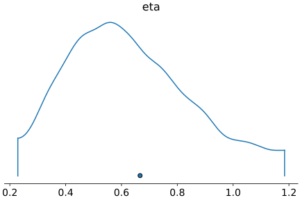

(see English translation below)

Esta entrada tiene al final el código en PyMC3 para la estimación Bayesiana de los parámetros de la heurística tallying. Especificamente, los pesos de los cues y la fuerza del prior penalizando el uso de toda la información  (adaptado de la version en R de  [Parpart, et al, 2018](https://www.sciencedirect.com/science/article/pii/S0010028517303286)). A continuación una explicación suscinta de la heurística y un resultado interesante de Parpart, et al, 2018.

Un teoría influyente sobre toma de decisiones es que los humanos usamos heurísticas, es decir, atajos para escoger entre opciones. Una heurística famosa es tallying. Parpart, et al, 2018 ponen un ejemplo intuitivo usando dos equipos de futbol. Si a usted le preguntan qué equipo va a ganar, Barcelona vs Atlético de Madrid, su respuesta con certeza se va a basar en características de cada equipo (no es fan de ninguno). Digamos que utiliza cuatro: a) posición en la liga, b) resultado del último partido, c) local o visitante y d) número de goles. Si usted fuera una inteligencia artificial, depronto usaría una regresión para determinar la importancia de cada característica usando data histórica. Sin embargo, la teoría de heurísticas afirma que las personas usamos estrategias más simples. En este caso, tallying se refiere a darle igual peso a todas las características, sumar, y escoger el que tenga mayor valor.
$$
Barcelona = Pos(20-3) + Ultimo(0) + Local(0) + Goles(44)
$$

$$
Atletico = Pos(20-0) + Ultimo(0) + Local(1) + Goles(38)
$$


En este ejemplo, Barcelona suma 61 y Atlético Madrid 59 (dentro de los paréntesis están los valores). Por lo tanto, la persona dice que Barcelona gana. Lo clave es notar que en tallying todas las características tienen un peso idéntico en la decisión. 

Gerd Gigerenzer y colegas han dedicado buena parte de su vida académica a demostrar que este tipo de estrategias no solo son fáciles para la mente humana sino que también pueden ser óptimas. Un principio importante que han derivado es el de menos información es mejor (less-is-more). En el caso de tallying, la información de cuanto ponderar cada característica no se necesita pues es más flexible no poner pesos (i.e. bias-variance trade-off favorece a variance en muchos contextos de decisiones). 

Una forma de pensar el principio less-is-more es con la actividad de dibujar con lapiz vs con colores. Pintar con colores puede acercarse más a la realidad, pero son díficiles de borrar. Sólo con lápiz, por su parte, limita a expresarse en blanco y negro pero hay más flexibilidad pues se puede borrar. La metáfora es para generar una intuición pues el argumento de Gigerenzer y colegas es más profundo y tiene que ver con el bias-variance tradeoff, donde modelos simples como tallying tienen buen poder predictivo, incluso mejor que regresión lineal simple con muestras pequeñas (e.g. reducen problemas de overfit).

> “There is a point where too much information and too much information processing can hurt” Gigerenzer and Todd (1999) (p. 21)

Sin embargo, recientemente Paula Parpart y colegas en el 2018 reflexionaron que less-is-more es un principio extraño. Proponen que el principio opuesto tiene sentido en muchos otros dominios: más información es mejor. Para demostrarlo, pusieron a prueba tallying  vs regresion en un marco Bayesiano común. Los detalles se pueden encontrar en el paper de ellos, pero la idea básica es simple: si hay una probabilidad grande de que las ponderaciones sean iguales es posible detectarlo con una aproximación bayesiana. En particular, se puede testear un prior de las ponderaciones de las caracteristicas (e.g. las 4 del ejemplo de fútbol; pero Parpart et al evaluaron 20 dominios diferentes, no solo fútbol) que en un extremo ponga todas las ponderaciones a una misma constante y en otro extremo haga una regresión tradicional. El prior que Parpart probó fue lo suficientemente flexible para encontrar posiblidades en cualquiera de estos dos extremos.   

En la gráfica de abajo está la estimación Bayesiana que hicé de este prior para un dominio particular (horas de sueño de varios mamiferos; ver código en PyMC3 abajo y explicación conceptual en Parpart, et al, 2018). Sin entrar en detalles, se puede observar que no es cero, de hecho esta centrado alrededor de 0.7. Esto significa que la versión extrema de less-is-more no es correcta (less-is-more puro era que eta fuera cero o muy cercano). Es bueno utilizar información. Pero por otro lado eta no es infinito (regresión pura sería eta infinito). Esto quiere decir que dada la estructura del dominio, lo mejor es un intermedio entre tallying y regresión. 

Lo impactante del paper de Paula Parpart y colegas es que nos permite entender mejor por qué los humanos usamos heurísticas: cuando hay un prior fuerte que los pesos sean iguales (eta=0) y esto depende de las características del ambiente. No solo eso. El paper de Parpart nos permite alejarnos de dicotomías extremas: se usan o no se usan heurísticas. Al contrario, la cognición humana se ubica en un continuo de un mismo proceso: usar información de forma apropiada.  

<center></center>


# English (by Google Translate with some edits)

This entry has at the end the code in PyMC3 for the Bayesian estimation of the parameters of the tallying heuristic. Specifically, the weights of the cues and the strength of the prior penalizing the use of all the information (adapted from the R version of [Parpart, et al, 2018](https://www.sciencedirect.com/science/article/pii/S0010028517303286)). Here is a succinct explanation of the heuristics and an interesting result from Parpart, et al, 2018.

An influential theory about decision making is that humans use heuristics, that is, shortcuts to choose between options. A famous heuristic is tallying. Parpart, et al, 2018 give an intuitive example using two soccer teams. If you are asked which team is going to win, Barcelona vs Atlético de Madrid, your answer will certainly be based on the characteristics of each team (you are not a fan of either). Let's say you use four: a) league position, b) last game result, c) home or away, and d) number of goals. If you were an artificial intelligence, you would use a regression to determine the importance of each characteristic using historical data. However, the theory of heuristics states that people use simpler strategies. In this case, tallying refers to giving equal weight to all the characteristics, adding, and choosing the one with the highest value.


$$
Barcelona = Pos(20-3) + Last(0) + Local(0) + Goals(44) \\\\ 
Atletico  = Pos(20-0) + Last(0) + Local(1) + Goals(38)
$$
In this example, Barcelona adds 61 and Atlético Madrid 59 (values inside parentheses). Therefore, the person says that Barcelona wins. The key is to note that in tallying all the characteristics have an identical weight in the decision.

Gerd Gigerenzer and colleagues have spent much of their academic life demonstrating that these types of strategies are not only easy for the human mind but can also be optimal. An important principle that they have derived is that less information is better (less-is-more). In the case of tallying, the information on how much to weight each characteristic is not needed since it is more flexible not to put weights (i.e. bias-variance trade-off favors variance in many decision contexts).

One way to think about the less-is-more principle is with a pencil vs color drawing activity. Painting with colors can be closer to reality, but they are difficult to erase. On the other hand, with pencil one limits to expressing in black and white but there is more flexibility as it can be erased. The metaphor is to generate an intuition since the argument of Gigerenzer and colleagues is deeper and has to do with the bias-variance tradeoff, where simple models such as tallying have good predictive power, even better than simple linear regression with small samples (e.g. they reduce overfit problems).

> “There is a point where too much information and too much information processing can hurt” Gigerenzer and Todd (1999) (p. 21)


However, recently Paula Parpart and colleagues in 2018 reflected that less-is-more is a strange principle. They propose that the opposite principle makes sense in many other domains: more information is better. To demonstrate this, they tested tallying vs. regression in a common Bayesian framework. The details can be found in their paper, but the basic idea is simple: if there is a high probability that the weights are equal it is possible to detect it with a Bayesian approximation. In particular, we can test a prior on the weights of the characteristics (e.g. the four of the soccer example; but Parpart et al evaluated 20 different domains, not just soccer) such that at one end the prior sets all the weights to the same constant (tallying) and in the other extreme the prior weights are sufficiently diffuse so that we execute a traditional regression. The prior Parpart tested was flexible enough to find possibilities at either extreme.

In the graph below is the Bayesian estimate I made of this prior for a particular domain (sleep hours of various mammals; see code in PyMC3 below and conceptual explanation in Parpart, et al, 2018). Without going into details, it can be seen that it is not zero, in fact it is centered around 0.7. This means that the extreme version of less-is-more is not correct (a pure less-is-more effect was that eta was zero or very close). It is good to use information. But on the other hand, eta is not infinite (pure regression would be eta equal infinity). This means that given the structure of the domain, the best is an intermediate between tallying and regression.

What is striking about the paper by Paula Parpart and colleagues is that it allows us to better understand why humans use heuristics: when there is a strong prior that the weights are equal (eta = 0) and this would depend on the structure of the environment. Not only that. Parpart's paper allows us to get away from extreme dichotomies: heuristics are used or not used. On the contrary, human cognition is located on a continuum of the same process: using information in the best possible way.

<center></center>

# Python

El material de Parpar et al (2018), los datos necesarios, y la implementación en PyMC3 también se pueden encontrar en este [link](https://github.com/santiagoalonso/Cognicion-Bayesiana/tree/main/Notebooks_Slides). Es el notebook 7_Adaptive_Toolbox.ipynb. La data esta en la carpeta data/7_CB/Parpart 2018/Data. 

The material from Parpar et al (2018), the necessary data, and the implementation in PyMC3 can also be found in this [link](https://github.com/santiagoalonso/Cognicion-Bayesiana/tree/main/Notebooks_Slides). It's the 7_Adaptive_Toolbox.ipynb notebook. The data is in the folder data / 7_CB / Parpart 2018 / Data.

```python
import os
import copy
import numpy as np
import pandas as pd
import pymc3 as pm
import theano.tensor as tt 
import theano
from theano.compile.ops import as_op
import arviz as az
from sklearn.model_selection import train_test_split

def sign(num):
    #num: 1D numpy array with numbers
    signs = deepcopy(num)
    signs[num<0] = -1
    signs[num>0] = 1
    signs[num==0] = 0
    
    return signs.astype('int')

def data_setup_parpart(idx_data, training_samples):
    #idx_data: scalar, data index in ALL_DATA
    #training_samples: scalar, number of training samples
    
    
    #ALL_DATA: ordered as Fig. 3 of Parpart et al 2018.
    ALL_DATA = ["house.world","mortality","cit.world","prf.world","bodyfat.world", "car.world","cloud",
            "dropout","fat.world", "fuel.world", "glps",
            "homeless.world", "landrent.world", "mammal.world", "oxidants",
            "attractiveness.men", "attractiveness.women", "fish.fertility","oxygen", "ozone"]

    y_pos = 2 #column position of dependent variable (criterion) i.e. correct answer to question is based on this 
    #in dataset, 0 below median, 1 above median. 
    #Gigerenzer et al, converted continuous variables to median splits 
    dataset = pd.read_table("data/7_CB/Parpart 2018/Data/" + ALL_DATA[idx_data] + ".txt")
    idx = list(range(4,dataset.shape[1])) #make sure all cues start at column 4
    col_cues = np.array(idx) #idx of columns with cues
    labels_cues = dataset.columns[idx]
    Predictors = len(labels_cues) #number of cues
    N = dataset.shape[0] # number of objects e.g cities
    #k = 100 #number of partitions for cross validations

    #Create Paired Data (ALL binary comparisons of objects e.g. cities)
    comb = np.array(list(combinations(list(range(N)), 2)))
    idx = np.stack([np.random.choice([0,1], 2, replace = False) for rep in range(comb.shape[0])]) #[0,1] shuffled many times
    comb = np.transpose(np.stack([comb[i,ele] for i,ele in enumerate(idx)])) #columns shuffled
    y = np.repeat(np.nan, comb.shape[1]) # correct classification; A(+1) or B(-1)  
    difference = np.repeat(np.nan, comb.shape[1]) 
    bdata_diff = pd.DataFrame(np.nan, index=np.arange(comb.shape[1]), columns=labels_cues)
    for i in range(comb.shape[1]):
        # takes out only the 2 rows from dataset that are compared at step i 
        binary = dataset.loc[comb[:,i],:].reset_index(drop=True) #2 random rows
        if i == 0:
            comparisons = binary
        else:
            comparisons = pd.concat([comparisons, binary])

        ## always compare row 1 with row 2 (no matter which ones has the higher criterion value) upper row - lower row
        if binary.iloc[0,y_pos] > binary.iloc[1,y_pos]:
            y[i] = 1 #(A)
        else:
            y[i] = - 1 #(B)

        ## cue values (row 1) - cue values (row 2) 
        bdata_diff.loc[i,:] = binary.loc[0,labels_cues] - binary.loc[1,labels_cues] # 

    bdata_diff['dependent'] = y
    paired_data = copy.deepcopy(bdata_diff)
    dataset = copy.deepcopy(paired_data)
    
    # Assess paired_data cue validities and order as v= R/R+W  ------R:right, W:wrong
    cue_validities_raw = np.repeat(np.nan, Predictors)
    cue_validities = np.repeat(np.nan, Predictors) #between 0 (does not predict which is better) and 1 (always predicts which is better)
    for c in range(Predictors):
        condition = (paired_data.iloc[:,c]==paired_data.loc[:,'dependent']).sum() == 0
        if condition: # stays 0 now if it was 0 
            cue_validities[c] = 0
        else:
            cue_validities_raw[c] = (paired_data.iloc[:,c]==paired_data.loc[:, 'dependent']).sum()/((paired_data.iloc[:,c]==1).sum()+(paired_data.iloc[:,c]==-1).sum()) 
            cue_validities[c] = cue_validities_raw[c] - 0.5 #the 0.5 is to make a 0.5 validity 0. Parpart's code says that this brings back to same scale as regression weights as otherwise order can be different!
    cue_order = np.argsort(-abs(cue_validities)) 
    

    # number of objects (e.g. paired cities comparisons) after evening out
    N = dataset.shape[0]

    #Partitions for cross-validation
    percent_training = training_samples/N
    # Generate the cross-validation partitions: 
    percent =(1 - percent_training)  #### Hold the testset (distinct from random training set) 
    training_sample_size = percent_training*N
    trainset, testset = train_test_split(dataset, test_size=percent)
    trainset = trainset.reset_index(drop=True)
    testset = testset.reset_index(drop=True)
    Predictors = trainset.shape[1]-1
    #Re-shuffling zero variance cases (incompatible with COR model) 
    cov_mat = trainset[labels_cues].corr()
    # NA cases = zero variance cases, get resampled now until one is found without any zero variance cases
    max_while = 1000000
    mm = 0
    while cov_mat.isna().any(axis = None) and mm<=max_while:
        trainset, testset = train_test_split(dataset, test_size=percent)
        trainset = trainset.reset_index(drop=True) 
        testset = testset.reset_index(drop=True)
        cov_mat = trainset[labels_cues].corr()
        if mm == max_while:
            raise NameError('Reshuffling zero variance cases took too long')
    
    return trainset, testset, Predictors, labels_cues, ALL_DATA[idx_data], cue_validities, cue_order, 	pd.read_table("data/7_CB/Parpart 2018/Data/" + ALL_DATA[idx_data] + ".txt")


#PyMC sampling
idx_data = 13 #There are 20 data sets i.e. between 0 and 19
#Problematic sets (e.g in sampling; or in partitions that take too long): 1, 6, 8,10,14,19 ... predictions for 7 are off
training_samples = 50 #for some datasets more than 20 wont work 
trainset, testset, Predictors, labels_cues, dataused, cue_validities, cue_order, dataset_original = data_setup_parpart(idx_data, training_samples)
cue_order2 = np.argsort(-cue_validities)
x = trainset.loc[:,labels_cues].iloc[:,cue_order2] # assumption that cue directionalities are known in advance (Dawes, 1979)  
y = trainset['dependent']
criterion = dataset_original.columns[2] #theme of the question e.g. higher price house for data set "house.world"
y[y<0] = 0 #changes dummy coding (option B:0; option A:1)
dirweights = sign(cue_validities[cue_order2]) # assumption that cue directionalities are known in advance (Dawes, 1979)  
col_pos = (dirweights > 0)*1
mixed_cues = any(col_pos==0) and any(col_pos==1)
with pm.Model() as Half_Ridge2:

    #Priors
    #eta
    eta_Ridge = pm.Uniform('eta', lower = 0.001, upper = 10)
    #Weights
    posNormal = pm.Bound(pm.Normal, lower=0.0)
    negNormal = pm.Bound(pm.Normal, upper=0.0)
    if mixed_cues:#some cues are positively and other negatively related to the criterion
        weight_pos = posNormal('weights_pos', mu=0, sigma=eta_Ridge, shape = (col_pos==1).sum())
        weight_neg = negNormal('weights_neg', mu=0, sigma=eta_Ridge, shape = (col_pos==0).sum())
        weights = pm.Deterministic('weights', tt.concatenate([weight_pos, weight_neg]))
    elif any(col_pos==1): #all cues are positively related to the criterion
        weight_pos = posNormal('weights_pos', mu=0, sigma=eta_Ridge, shape = (col_pos==1).sum())
        weights = pm.Deterministic('weights', weight_pos)
    elif any(col_pos==0): #all cues are negatively related to the criterion
        weight_neg = negNormal('weights_neg', mu=0, sigma=eta_Ridge, shape = (col_pos==0).sum())
        weights = pm.Deterministic('weights', weight_pos)
    print(weights.tag.test_value.shape)   
    

    #Likelihood
    mu = weights*x #rows stimulus, columns: cues, cells: cue*weight
    print(mu.tag.test_value.shape)
    theta = pm.Deterministic('theta', pm.math.sigmoid(tt.sum(mu, axis=1)))
    print(theta.tag.test_value.shape) 
    y_1 = pm.Bernoulli('y_1', p=theta, observed=y) 

    #Sampling 
    trace = pm.sample(1000, init = 'adapt_diag', tune=1500, target_accept = 0.95)
    #ppc = pm.sample_posterior_predictive(trace, samples=5000)
    data = az.from_pymc3(trace=trace)

az.plot_density(data, var_names=['eta']);
```


## Referencias:

Parpart, P., Jones, M., & Love, B. C. (2018). Heuristics as Bayesian inference under extreme priors. *Cognitive psychology*, *102*, 127-144.

