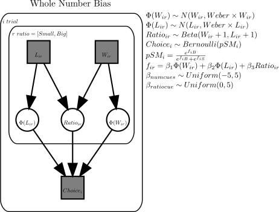
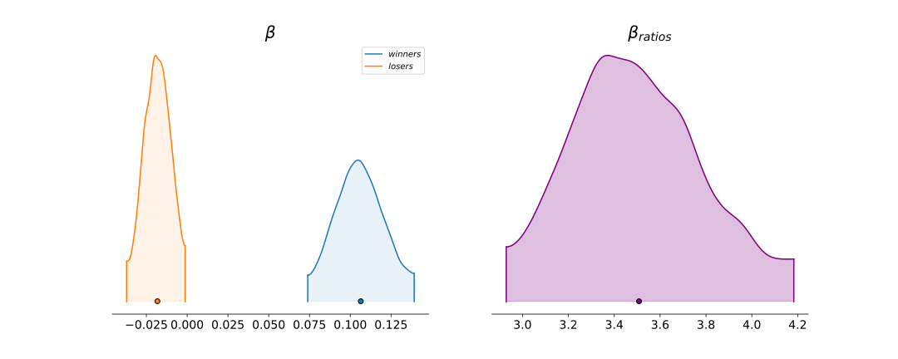
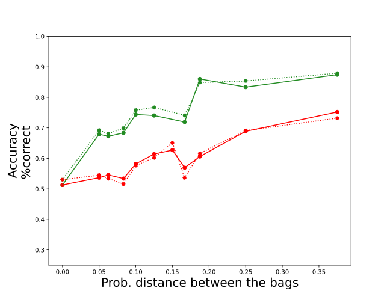

(see English translation below)

Este paper tiene al final el código bayesiano en PyMC3 para estimar el intrinsic whole-number bias [(Alonso-Díaz, Piantadosi, Hayden, & Cantlon, 2018)](http://colala.berkeley.edu/papers/alonsodiaz2018intrinsic.pdf)

Es usual encontrar en toma de decisiones y en ambientes académicos que la gente tiende a usar el numerador cuando compara proporciones (e.g. probabilidades en el trabajo, fraccionarios en clase, indices financieros). Es un problema presente en la mayoría, incluso en matemáticos de alto nivel.

Hay muchas [ilusiones cognitivas](http://illusionoftheyear.com/) automáticas (impenetrables cognitivamente). En esta entrada resumiré dos ideas que acercan el sesgo a numeradores altos en una categoría de ilusión, más que un error en calcular fracciones: 1) la gente tiene la ilusión que opciones con numeradores altos tienen proporciones mayores, y 2) esto ocurre aún si la persona computa el valor de las proporciones (el sesgo es intrinseco/automático)

Les preguntamos a varios participantes que escogieran repétidamente entre dos loterías, una a la izquierda y otra a la derecha. Cada lotería se mostró con imagenes con bolas azules (ganadoras) y naranjas (perdedoras). Tenían que escoger una lotería/bolsa, con la condición de que si sacaban una bola azul ganaban (todo era hipotético). Esto durante varios turnos. En algunos turnos, la bolsa con la mejor proporción tenía más bolas ganadoras (condición congruente) y en otros menos (condición incongruente).

Nuestros participantes, como en literatura previa, mostraron una fuerte preferencias por loterías con mayor número de ganadoras (azules). 

Para determinar sí este efecto comportamental es una ilusión intrinseca, es decir, que ocurre aún cuando se computa el ratio, ajustamos el siguiente modelo (ver diagrama abajo). Los cuadros grises son datos y los circulos blancos son parámetros latentes/no-observables. $L$ y $W$ es el número de perdedoras (Losers) y ganadoras (Winners) que el participante ve en cada bolsa. $Choice$ es la decisión que tomó el participante en el turno i. $\Phi$ denota la percepción de la numerosidad de las bolas [(Dehaene, 2007)](https://www.semanticscholar.org/paper/Symbols-and-quantities-in-parietal-cortex%3A-elements-Dehaene/ec2f20f9cc05f2f2c009ac7fb42e591405b42ece?p2df). La decisión es estocástica y sigue una probabilidad softmax ($pSM$). 

<center></center>

En el modelo la decisión es una combinación líneal de la percepción del número de ganadoras (azules), perdedoras, y la proporción   de azules (ver formula para $f_{ir}$ en el diagrama). El posterior inferido del peso para la proporción de azules ($\beta_{ratios}$) es mayores a cero. Los participantes usaban la proporción de azules en su decisión (gráfica de abajo). El modelo hace un buen trabajo en replicar las decisiones promedios (gráfico más abajo; línea punteada datos humanos; línea sólida promedio modelo i.e. del posterior predictive; verde turnos congruentes; rojo turnos incongruentes).     

<center></center>

<center></center>


El modelo permitió inferir que el sesgo por numeradores altos no es una simple falla en percibir/calcular valores fraccionales: los pesos de decisión no son cero para las proporciones de azules (más detalles en Alonso-Díaz, et al, 2018). El whole-number bias es más cercano a una ilusión cognitiva. Aún cuando sabemos que hay algo mal, es inevitable caer. Por eso es observable en todos los niveles educativos e incluso en matemáticos, estadísticos, financistas, y científicos experimentados. 


# English (by Google Translate with some edits)


This paper has at the end the Bayesian code in PyMC3 to estimate the intrinsic whole-number bias [(Alonso-Díaz, Piantadosi, Hayden, & Cantlon, 2018)](http://colala.berkeley.edu/papers/alonsodiaz2018intrinsic.pdf)

It is common to find in decision-making and academic settings that people tend to use the numerator when comparing proportions (e.g. probabilities at work, fractions in class, financial indices). It is a problem present in most, even high-level mathematicians.

There are many [cognitive illusions](http://illusionoftheyear.com/)  (cognitively impenetrable). In this post I will summarize two ideas that bring the bias towards high numerators closer to being an illusion, rather than an error in calculating fractions: 1) people are under the illusion that options with high numerators have larger proportions, and 2) this occurs even if the person computes the value of the proportions (bias is intrinsic / automatic)

We asked several participants to repeatedly choose between two lotteries, one on the left and one on the right. Each lottery was shown with images with blue  (winners) and orange (losers) balls. They had to choose a lottery / bag, on the condition that if they drew a blue ball they won (it was all hypothetical). This for several trials. In some trials, the bag with the best proportion had more winning balls (congruent condition) and in others fewer (incongruous condition).

Our participants, as in previous literature, showed a strong preference for lotteries with a higher number of winners (blue).

To determine if this behavioral effect is an intrinsic illusion, that is, that it occurs even when the ratio is computed, we fitted the following model (see diagram below). The gray boxes are data and the white circles are latent / unobservable parameters. $L$ and $W$ is the number of losers and winners that the participant sees in each bag. $Choice$ is the decision made by the participant in trial i. $\Phi$ denotes the perception of the numbers of the balls [(Dehaene, 2007)](https://www.semanticscholar.org/paper/Symbols-and-quantities-in-parietal-cortex%3A-elements-Dehaene/ec2f20f9cc05f2f2c009ac7fb42e591405b42ece?p2df). The decision is stochastic and follows a softmax probability ($pSM$). 

<center></center>

In the model the decision is a linear combination of the perception of the number of winners (blues), losers, and the proportion of blues (see formula for $ f_ {ir} $ in the diagram). The inferred posterior weight for the ratio of blue balls ($ \beta_{ratios} $) is greater than zero. Participants used the proportion of blues in their decision (graph below). The model does a good job of replicating average decisions (graph further below; dotted line human data; average solid line model i.e. from the posterior predictive; green congruent trials; red incongruous trials).

<center></center>

<center></center>


The model allowed us to infer that the bias towards high numerators is not a simple failure to perceive / calculate fractional values: the decision weights are not zero for the proportions of blue (more details in Alonso-Díaz, et al, 2018). The whole-number bias is closer to a cognitive illusion. Even when we know there is something wrong, it is inevitable to fall. That is why it is observable at all educational levels and even in mathematicians, statisticians, financiers, and experienced scientists.


# Python

El material, los datos necesarios, y la implementación en PyMC3 también se pueden encontrar en este [github](https://github.com/santiagoalonso/Cognicion-Bayesiana/tree/main/Notebooks_Slides). Es el notebook 8_Numerosity.ipynb. La data esta en la carpeta data/8_CB/WNB.csv 

The material, the necessary data, and the implementation in PyMC3 can also be found in this [github](https://github.com/santiagoalonso/Cognicion-Bayesiana/tree/main/Notebooks_Slides). It's the 8_Numerosity.ipynb notebook. The data is in the folder data/8_CB/WNB.csv

```python
#Load data
#Performance: 0 wrong, 1 correct
#RT: response time in secs
#ProbRatio: small ratio / large ratio
#NumRatio: small numerator / large numerator
#DenRatio: small denominator / large denominator
#AreaCtl: dots across bags have 1: equal dot size, 2: equal cumulative area
#WinSide1: number of winners left bag
#WinSide2: number of winners right bag
#DenSide1: total balls left bag
#DenSide2: total balls right bag
#ProbSide1: probability of win left bag
#ProbSide2: probability of win right bag
#sideR: side of response; 1 left, 2 right, 0 no response.
#subID: subject identifier

WNB_all = pd.read_csv('data/8_CB/WNB.csv')
WNB_all['ProbDistance'] = np.abs(WNB_all['ProbSide1']-WNB_all['ProbSide2'])
WNB_all = WNB_all.loc[WNB_all['sideR']>0,:].reset_index(drop=True)

idx1 = WNB_all['ProbSide1']>=WNB_all['ProbSide2']
WNB_all['WinSmallRatio'] = int(0)
WNB_all['DenSmallRatio'] = int(0)
WNB_all['WinBigRatio'] = int(0)
WNB_all['DenBigRatio'] = int(0)
for i in range(WNB_all.shape[0]):
    if idx1[i]:
        WNB_all.loc[i,'WinSmallRatio'] = WNB_all.loc[i,'WinSide2']
        WNB_all.loc[i,'DenSmallRatio'] = WNB_all.loc[i,'DenSide2']
        WNB_all.loc[i,'WinBigRatio'] = WNB_all.loc[i,'WinSide1']
        WNB_all.loc[i,'DenBigRatio'] = WNB_all.loc[i,'DenSide1']
    else:
        WNB_all.loc[i,'WinSmallRatio'] = WNB_all.loc[i,'WinSide1']
        WNB_all.loc[i,'DenSmallRatio'] = WNB_all.loc[i,'DenSide1']
        WNB_all.loc[i,'WinBigRatio'] = WNB_all.loc[i,'WinSide2']
        WNB_all.loc[i,'DenBigRatio'] = WNB_all.loc[i,'DenSide2']
sID = WNB_all['subID'].unique()
subj_to_model = -1 #0 to 20; -1 for all
WNB = WNB_all
if subj_to_model>=0:
    WNB = WNB_all.loc[WNB_all['subID']==sID[subj_to_model],:].reset_index(drop=True) 
weber = 0.286679553540291 #mean value of participants (see paper)
winners_s = np.sort(WNB['WinSmallRatio'].unique())
winners_b = np.sort(WNB['WinBigRatio'].unique())
winners = np.sort(pd.concat([pd.Series(winners_s), pd.Series(winners_b)]).unique())
losers_s = np.sort((WNB['DenSmallRatio']-WNB['WinSmallRatio']).unique())
losers_b = np.sort((WNB['DenBigRatio']-WNB['WinBigRatio']).unique())
losers = np.sort(pd.concat([pd.Series(losers_s), pd.Series(losers_b)]).unique())
sn = np.array(WNB['WinSmallRatio'], dtype = str)
sd = np.array(WNB['DenSmallRatio'], dtype = str)
r = []
for idx, ele in enumerate(sn):
    r.append(ele + "_" + sd[idx])
bn = np.array(WNB['WinBigRatio'], dtype = str)
bd = np.array(WNB['DenBigRatio'], dtype = str)
for idx, ele in enumerate(bn):
    r.append(ele + "_" + bd[idx])
r = pd.Series(r).unique()
ratios = np.zeros((r.shape[0],3))
for idx, ele in enumerate(r):
    temp = np.array(ele.split("_"), dtype = int)
    ratios[idx,0] = temp[0] #num
    ratios[idx,1] = temp[1] #den
    ratios[idx,2] = temp[0]/temp[1] #ratio
print(winners.shape, losers.shape, ratios.shape)

#Indices (for vectors with unique values)
side1 = np.zeros((WNB.shape[0],3)) #column order: index for winners, losers, ratios
side2 = np.zeros((WNB.shape[0],3))
for i in range(WNB.shape[0]):
    #side 1
    w = WNB.loc[i, 'WinSmallRatio'] 
    den = WNB.loc[i, 'DenSmallRatio'] 
    l = den - w
    side1[i,0] = np.where(winners == w)[0][0]
    side1[i,1] = np.where(losers == l)[0][0]
    side1[i,2] = np.where((ratios[:,0] == w) & (ratios[:,1] == den))[0][0]
    
    #side 2
    w = WNB.loc[i, 'WinBigRatio'] 
    den = WNB.loc[i, 'DenBigRatio'] 
    l = den - w
    side2[i,0] = np.where(winners == w)[0][0]
    side2[i,1] = np.where(losers == l)[0][0]
    side2[i,2] = np.where((ratios[:,0] == w) & (ratios[:,1] == den))[0][0]
side1 = side1.astype(int)
side2 = side2.astype(int)

#choice data
idx1 = WNB['ProbSide1']>=WNB_all['ProbSide2']
idx2 = WNB['sideR'] == 1
WNB['correct'] = np.array((idx1 & idx2) | (~idx1 & ~idx2), dtype = int)
choice = WNB['correct'] #0: incorrect; 1: correct
#WNB
```


​    
```python
#Model
with pm.Model() as WNB_model:
    
    #priors
    #percepts of winners and losers assumed different e.g. due to lose aversion
    Winners = pm.Normal('percept_winners', 
                        mu = winners, sd = weber*winners, shape = winners.shape)
    Losers = pm.Normal('percept_losers', 
                       mu = losers, sd = weber*losers, shape = losers.shape) 
    Ratios = pm.Beta('percept_ratios', 
                     alpha = ratios[:,0] + 1, 
                     beta = ratios[:,1] - ratios[:,0] + 1, shape = ratios.shape[0])
    Weight_win = pm.Uniform('weight_win', lower = -5, upper = 5)
    Weight_lose = pm.Uniform('weight_lose', lower = -5, upper = 5)
    Weight_ratio = pm.Uniform('weight_ratio', lower = 0, upper = 5)

    
    #likelihood
    f_side1 = Weight_ratio*Ratios[side1[:,2]] + Weight_win*Winners[side1[:,0]] + Weight_lose*Losers[side1[:,1]]
    f_side2 = Weight_ratio*Ratios[side2[:,2]] + Weight_win*Winners[side2[:,0]] + Weight_lose*Losers[side2[:,1]]
    softmax = tt.exp(f_side2)/(tt.exp(f_side1) + tt.exp(f_side2)) #prob. of picking side 2
    choice_LH = pm.Bernoulli('choice', p = softmax, observed = choice)

  
    #sampling
    trace = pm.sample(1000, init = 'adapt_diag', tune=1500)
    ppc = pm.sample_posterior_predictive(trace, samples=5000)
    data = az.from_pymc3(trace=trace)
```


```python
#Weights for numbers and ratios. 
#They are not zero, both explain human behavior.
#Even computing ratios, we still use raw numerosity information
fig, ax = plt.subplots(1,2, figsize = [15,6])
az.plot_density(
    [trace['weight_win'], trace['weight_lose']],
    data_labels=["$winners$", 
                 "$losers$"],
    shade=.1, ax = ax[0], hdi_prob=.95, 
)
az.plot_density(
    [trace['weight_ratio']], hdi_prob=.95,
    data_labels=["$\\beta_{ratio}$"], outline=True,
    shade=.25, ax = ax[1], colors = 'purple', 
)
ax[0].set_title('$\\beta$', fontsize = 20)
ax[1].set_title('$\\beta_{ratios}$', fontsize = 20)
ax[0].legend(loc='upper right');
```


```python
#Posterior predictive (dotted humans; solid model)
idx_cong = WNB['WinBigRatio']>WNB['WinSmallRatio'] #Congruent trial
idx_incong = ~idx_cong #Incongruent trial
ppc_cong = pd.concat([pd.DataFrame(ppc['choice'].mean(axis=0)[idx_cong], columns = ['choice_model']), 
                      WNB.loc[idx_cong,:].reset_index(drop=True)], axis = 1)
ppc_incong = pd.concat([pd.DataFrame(ppc['choice'].mean(axis=0)[idx_incong], columns = ['choice_model']), 
                        WNB.loc[idx_incong,:].reset_index(drop=True)], axis = 1)

toplot_cong = ppc_cong.groupby(['ProbDistance']).mean()[['choice_model','correct']].reset_index()
toplot_incong = ppc_incong.groupby(['ProbDistance']).mean()[['choice_model','correct']].reset_index()
idx1 = toplot_cong['ProbDistance']==0
idx2 = toplot_incong['ProbDistance']==0
mean0 = (toplot_cong.loc[idx1,'correct'] + toplot_incong.loc[idx2,'correct'])/2
toplot_cong.loc[idx1,'correct'] = mean0 #In prob. distance 0 congruent, incongruente doesn't apply
toplot_incong.loc[idx2,'correct'] = mean0
mean0 = (toplot_cong.loc[idx1,'choice_model'] + toplot_incong.loc[idx2,'choice_model'])/2
toplot_cong.loc[idx1,'choice_model'] = mean0 #In prob. distance 0 congruent, incongruente doesn't apply
toplot_incong.loc[idx2,'choice_model'] = mean0

fig = plt.figure(figsize=[9,7])
plt.plot(toplot_cong['ProbDistance'], toplot_cong['correct'], color = 'forestgreen', linestyle = ':')
plt.scatter(toplot_cong['ProbDistance'], toplot_cong['correct'], color = 'forestgreen', linestyle = ':')
plt.plot(toplot_incong['ProbDistance'], toplot_incong['correct'], color = 'red', linestyle = ':')
plt.scatter(toplot_incong['ProbDistance'], toplot_incong['correct'], color = 'red', linestyle = ':')

plt.plot(toplot_cong['ProbDistance'], toplot_cong['choice_model'], color = 'forestgreen')
plt.scatter(toplot_cong['ProbDistance'], toplot_cong['choice_model'], color = 'forestgreen')
plt.plot(toplot_incong['ProbDistance'], toplot_incong['choice_model'], color = 'red')
plt.scatter(toplot_incong['ProbDistance'], toplot_incong['choice_model'], color = 'red');

plt.ylim([0.25,1])
plt.xlabel('Prob. distance between the bags', fontsize = 20)
plt.ylabel('Accuracy\n%correct ', fontsize = 20);
```


## Referencias:

Alonso-Díaz, S., Piantadosi, S. T., Hayden, B. Y., & Cantlon, J. F. (2018). Intrinsic whole number bias in humans. *Journal of Experimental Psychology: Human Perception and Performance*, *44*(9), 1472.

Dehaene, S. (2007). Symbols and quantities in parietal cortex: Elements of a mathematical theory of number representation and manipulation. *Sensorimotor foundations of higher cognition*, *22*, 527-574.

