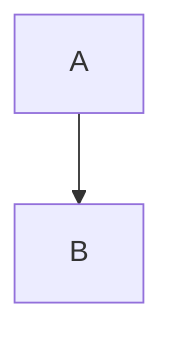
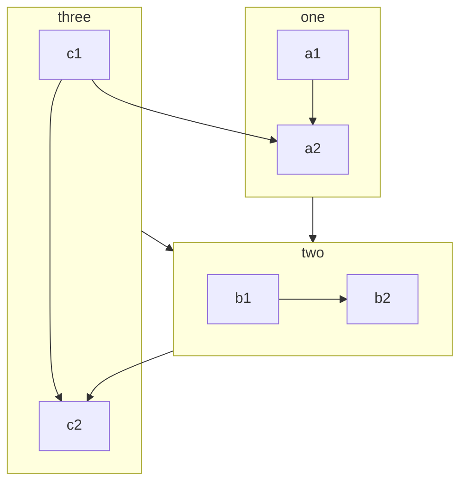
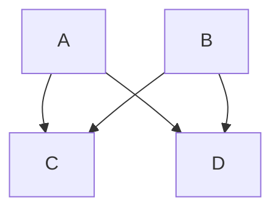
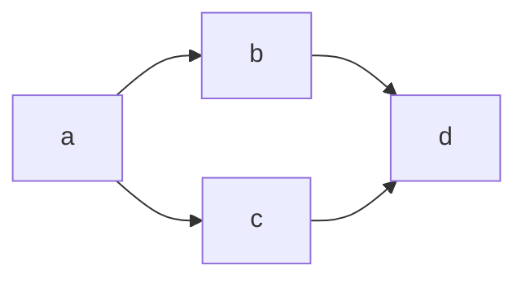
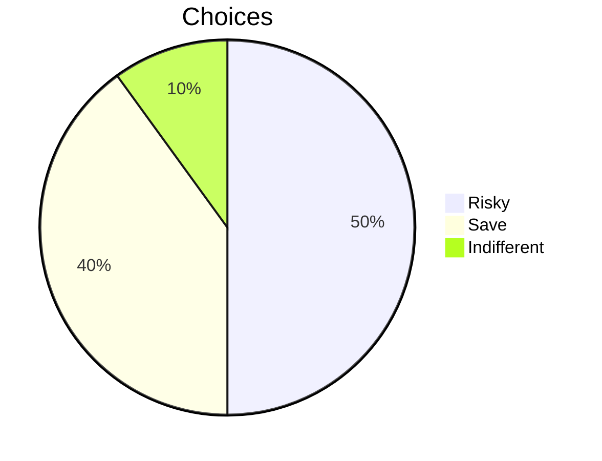

# Diagram 1

```mermaid
graph TD
A --> B
```

# Diagram 2


```mermaid
flowchart TB
c1-->a2
subgraph one
a1-->a2
end
subgraph two
b1-->b2
end
subgraph three
c1-->c2
end
one --> two
three --> two
two --> c2
```

# Diagram 3


```mermaid
	graph TB
	    A & B--> C & D
```

# Diagram 4

```mermaid
	graph LR
	   a --> b & c--> d
```

# Charts


```mermaid
	pie title Choices
	"Risky": 50
	"Save": 40
	"Indifferent": 10
```

# Python Code

```python
for i in range(8):
	print(i)
```