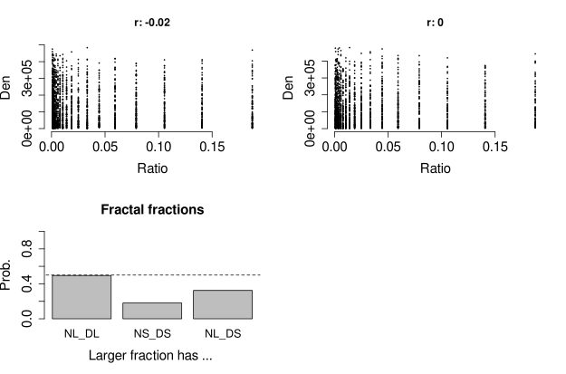

# Español (English below; by Google translate)

Muchos patrones en la vida tienen estructuras que se repiten. Se asemejan a procesos fractales donde las proporciones se asemejan a diferentes escalas. Esta propiedad fue parte de la inspiración de un [paper reciente](https://www.sciencedirect.com/science/article/pii/S0001691820305722) que escribimos con un colega sobre una ilusión cognitiva que aparece en adultos y niños, independiente del nivel y tipo de educación (incluso matemáticos de alto nivel): el whole-number bias. Propusimos que si hay independencia entre el valor del denominador y el del ratio, entonces en un par aleatorio de fracciones la de mayor valor va a ser la que tiene el mayor numerador con una alta probabilidad. El estimativo empirico fue alrededor de 0.8. Sugerimos que la independencia entre la magnitud del denominador y el valor del ratio no es una simple curiosidad matemática sino que puede ocurrir seguido en la naturaleza como lo son los fractales. En esta entrada muestro el caso de un fractal clásico: el triangulo de Sierpinski (ver imagen abajo).  

Tomé distintas iteraciones aleatorias del triangulo y calcule el ratio del area sin sombra sobre el area con sombra ([codigo R](https://github.com/santiagoalonso/starter-academic/blob/master/content/post/Fractals_Whole_Number_Bias/SimsPlot.R)). Luego compare para dos valores de ese ratio cuál era el mayor y conté cuantas veces tenía el numerador y denominador mayor (NLDL), numerador y denominador menor (NSDS), y numerador mayor y denominador menor (NLDS) (N: numerator, D: denominator, L: larger, S: smaller). No hay más casos pues valores iguales en numerador y denominador en ambas fracciones son poco probables. La imagén de abajo muestra dos cosas interesantes. Primero, para distintos valores de ratio aparecían denominadores en todo el rango (paneles superiores). Es decir, los valores de ratio eran independientes del denominador i.e. por definición, los fractales son auto-semejantes a cualquier escala (denominador). Segundo, el ratio mayor tiene muchas veces numeradores altos: NLDL + NLDS es aproximadamente 0.82. 

En un mundo fractal tiene sentido tener un whole-number bias via el numerador. Esto afecta no solo a los estudiantes que aprenden fracciones, también a organismos que toman decisiones reales pues cantidades relativas abundan en la realidad (e.g. probabilidades, Weber fractions, normalización neuronal, etc)

# English (by Google translate with minor edits)

Many patterns in life have repeating structures. They resemble fractal processes where the proportions resemble at different scales. This property was part of the inspiration for a [recent paper](https://www.sciencedirect.com/science/article/pii/S0001691820305722) that we wrote with a colleague about a cognitive illusion that appears in adults and children, regardless of the level and type of education (including high-level mathematicians): the whole-number bias. We proposed that if there is independence between the value of the denominator and that of the ratio, then in a random pair of fractions the one with the highest value will be the one with the highest numerator with a high probability. The empirical estimate was around 0.8. We suggested that the independence between the magnitude of the denominator and the value of the ratio is not a simple mathematical curiosity but can occur often in nature e.g. in fractals. In this post I show the case of a classic fractal: the Sierpinski triangle (see image below).

I took different random iterations of the triangle and calculated the ratio of the unshaded area over the shaded area ([R code](https://github.com/santiagoalonso/starter-academic/blob/master/content/post/Fractals_Whole_Number_Bias/SimsPlot .R)). Then, I compared for two values of that ratio which was the greater and counted how many times had the larger numerator and denominator (NLDL), smaller numerator and denominator (NSDS), and larger numerator and smaller denominator (NLDS) (N: numerator, D: denominator, L: larger, S: smaller). There are no more cases since equal values in numerator and denominator in both fractions are unlikely. The image below shows two interesting things. First, for different ratio values, denominators appeared throughout the range (upper panels). That is, the ratio values were independent of the denominator i.e. by definition, fractals are self-similar at any scale (denominator). Second, higher ratios have many times higher numerators: NLDL + NLDS is approximately 0.82.

In a fractal world it makes sense to have a whole-number bias via the numerator. This affects not only students who learn fractions, but also organisms that make real decisions since relative quantities abound in reality (e.g. probabilities, Weber fractions, neural normalization, etc.)