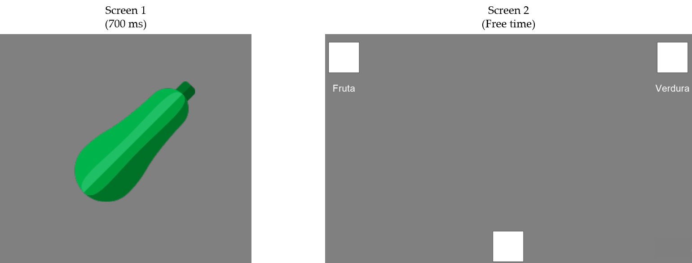

# Español (English below; by Google translate)

El análisis de trayectorias de mouse o en pantallas táctiles ha tomado fuerza en los últimos 10 años en ciencia cognitiva (e.g. [see Dotan, et al, 2019](https://www.sciencedirect.com/science/article/abs/pii/S1364661319302372)). La trayectorias son una ventana a procesamiento cognitivo interno. Por ejemplo, cuando hay que escoger entre dos opciones que difieren poco en valor, y hay que seleccionar en una pantalla táctil, el movimiento es más lento hacía la opción escogida reflejando su cercanía mental en valor. 

Hay software gratuito para recoger trayectorias ([e.g. 1](https://trajtracker.wixsite.com/trajtracker), [e.g. 2](http://www.mousetracker.org/)), pero son algo especificos. Psychopy es una libreria más general en Python para hacer experimentos que se conecta a Pavlovia, un servicio para hacer experimentos en línea, de forma relativamente fácil ("relativamente", hay veces puede ser enredado). 

En esta entrada muestro un experimento simple en Psychopy para recoger trayectorias ([acá los archivos y códigos](https://github.com/santiagoalonso/starter-academic/tree/master/content/post/Psychopy_Trajectories/Ppy)). La persona tiene que decidir si una imagen, que ve por poco tiempo, es fruta o verdura. Para empezar, debe poner su dedo (o mouse) en un rectangulo inicial en la parte baja de la pantalla. Tan pronto ponga el dedo, aparecen dos opciones/rectangulos en la parte superior izquierda y derecha: "FRUTA" y "VERDURA". La persona escoge moviendo el dedo desde el rectangulo inferior a uno de los dos rectangulos superiores. 

Los datos quedan en formato csv, incluyendo las decisiones discretas en cada turno (FRUTA, VERDURA), tiempos de reacción (RT: tiempo en salir del rectangulo inferior), tiempos de movimiento (MT: tiempo en llegar a las opciones luego de salir del rectangulo inferior ), coordenadas x,y, y tiempo t de cada coordenada.     

El código creo que es valioso pues Psychopy por default puede recoger la posición x,y pero hay que hacer click en objetos para pasar al siguiente turno. En este ejemplo, se pasa tan pronto se toque la opción preferida, sin hacer click en el mouse. Por ello es más apropiado para pantallas táctiles. 

# English (by Google translate)

The analysis of mouse or touch screen trajectories has gained momentum in the last 10 years in cognitive science (eg [see Dotan, et al, 2019](https://www.sciencedirect.com/science/article/abs/pii / S1364661319302372)). Trajectories are a window into internal cognitive processing. For example, when you have to choose between two options that differ little in value, and you have to select on a touch screen, the movement is slower towards the chosen option reflecting its mental closeness in value.

There is free software to collect trajectories ([e.g. 1](https://trajtracker.wixsite.com/trajtracker), [e.g. 2](http://www.mousetracker.org/)), but they are somewhat specific. Psychopy is a more general Python library for doing experiments that connects to Pavlovia, a service for doing experiments online, relatively easily ("relatively", there are times it can be confusing).

In this post I show a simple experiment in Psychopy to collect trajectories ([here the files and codes](https://github.com/santiagoalonso/starter-academic/tree/master/content/post/Psychopy_Trajectories/Ppy)). The person has to decide whether an image, which he sees for a short time, is a fruit or a vegetable. To begin, they must put their finger (or mouse) in a starting rectangle at the bottom of the screen. As soon the finger is in the bottom rectangle, two options / rectangles appear at the top left and right: "FRUIT" and "VEGETABLE". The person chooses by moving his finger from the lower rectangle to one of the two upper rectangles.

The data is in csv format, including the discrete decisions in each trial (FRUIT, VEGETABLE), reaction times (RT: time taken to leave the lower rectangle), movement times (MT: time to reach the options after leaving the lower rectangle), x, y coordinates, and time t of each coordinate.

I think the code is valuable because Psychopy by default can pick up the position x, y, but to go to the next turn one of the objects has to be clicked. In this example, the next trial begins as soon as the preferred option is touched, without clicking the mouse. Therefore it is more suitable for touch screens.

